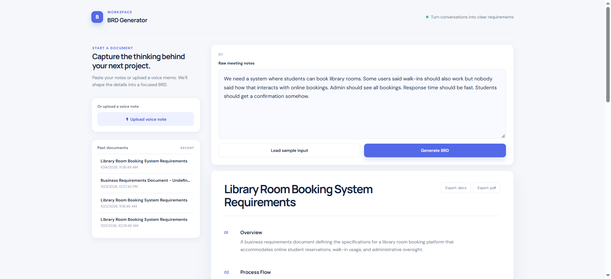
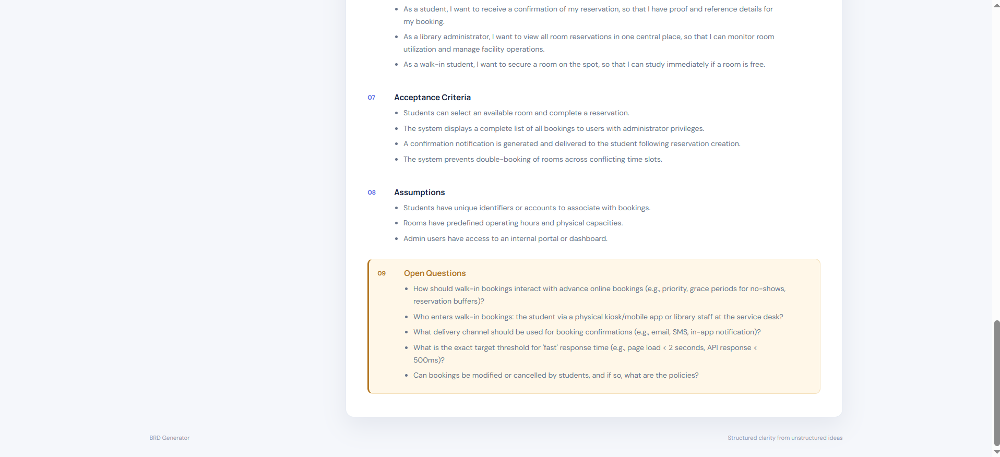
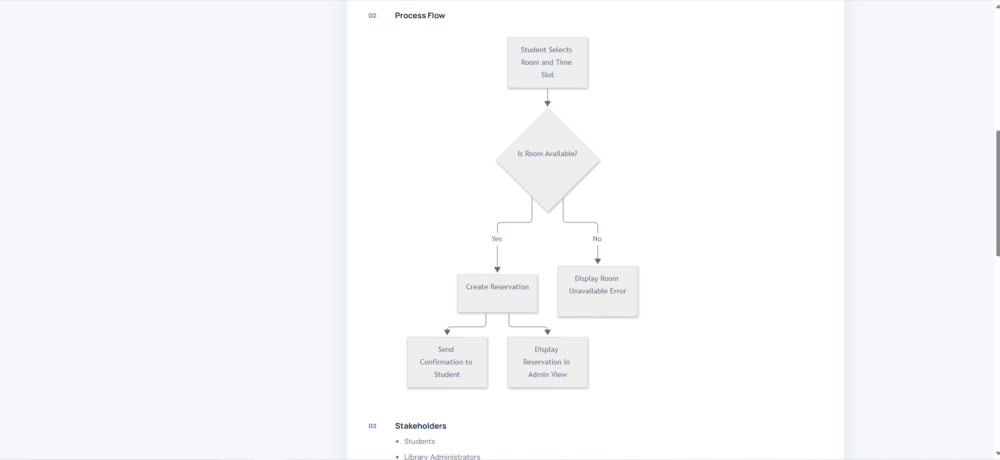
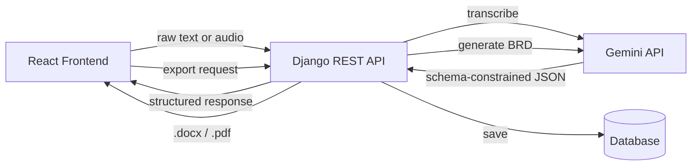

# BRD Generator

Turn messy meeting notes — typed or spoken — into a structured Business Requirements Document in seconds.

## The Problem

Requirements gathering is one of the most failure-prone stages of any software project. Surveys of practicing Business Analysts consistently point to the same recurring issues: success criteria that are never clearly defined, requirements that shift after the fact, conflicting input from different stakeholders in the same meeting, and a persistent gap between how clients describe what they want and the structured language a dev team needs to build it.

In practice, this means a BA walks out of a client meeting with a page of rambling, sometimes contradictory notes — and has to manually convert that into a formal BRD: requirements, user stories, acceptance criteria, and (most easily skipped) a list of what's still genuinely unclear.

**BRD Generator automates that conversion** — and, critically, doesn't paper over ambiguity. It explicitly surfaces contradictions and missing information instead of silently guessing, because a BRD that hides its own uncertainty is more dangerous than one that admits it.

## Key Features

- **Natural language → structured BRD** — paste raw meeting notes, get back a full BRD: overview, stakeholders, functional & non-functional requirements, user stories, acceptance criteria, and assumptions
- **Ambiguity detection** — actively flags contradictions, undefined actors, and missing information as explicit open questions, rather than resolving them silently
- **Voice note input** — upload an audio recording of a client conversation; it's transcribed and run through the same generation pipeline as typed input
- **Process flow diagram** — automatically generates a visual flowchart of the core process described in the requirements
- **Export to Word & PDF** — every generated BRD can be downloaded as a formatted `.docx` or `.pdf`
- **History** — every generated document is saved and browsable, not just the most recent one

## Screenshots

**Input — paste messy meeting notes or upload a voice note**


**Structured output — requirements, user stories, and flagged open questions**


**Auto-generated process flow diagram**


## Tech Stack

| Layer | Technology |
|---|---|
| Frontend | React (Create React App), Axios |
| Backend | Django, Django REST Framework, django-cors-headers |
| AI | Google Gemini API (`google-genai`), structured JSON output via schema-constrained generation |
| Database | SQLite (dev) |
| Export | `python-docx`, `reportlab` |
| Diagrams | Mermaid.js |

## Architecture



## Setup Instructions

### Backend

```bash
cd backend
venv\Scripts\activate          # Windows
# source venv/bin/activate     # macOS/Linux

pip install -r requirements.txt

# Create a .env file in backend/ with:
# GEMINI_API_KEY=your_key_here

python manage.py migrate
python manage.py runserver
```

### Frontend

```bash
cd frontend
npm install
npm start
```

The app will be available at `http://localhost:3000`, calling the API at `http://127.0.0.1:8000`.

## Usage

1. Paste raw meeting notes into the text box — or upload a short voice recording instead
2. Click **Generate BRD**
3. Review the structured output: requirements, user stories, acceptance criteria, process flow diagram, and flagged open questions
4. Export to Word or PDF, or revisit it later from the history panel

### Example

**Input:**
> "We need a system where students can book library rooms. Some users said walk-ins should also work but nobody said how that interacts with online bookings. Admin should see all bookings."

**Output includes**, among other sections:
> **Open Questions:** How do walk-in bookings interact with online bookings — is there a conflict resolution rule?

That's the core value proposition in one line: the tool doesn't just organize what was said — it notices what wasn't.

## Roadmap

- Client-facing plain-language confirmation summary (auto-generated, separate from the technical BRD)
- MoSCoW prioritization tags on individual requirements
- Multi-stakeholder input reconciliation (merge notes from several meeting participants, surface where they disagree)

## License

MIT
